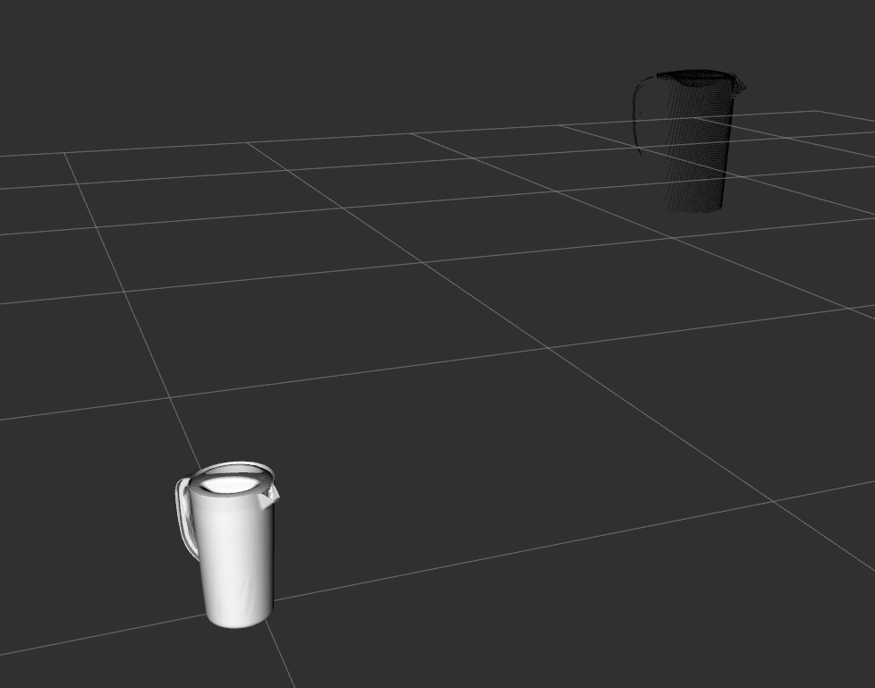
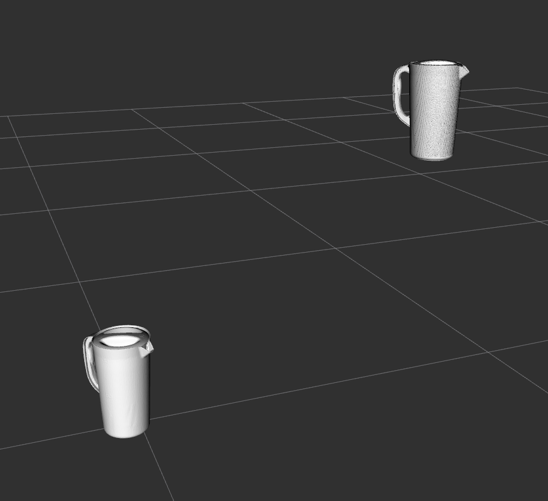

# point_cloud_tools

This package fits a mesh to a pointcloud using iterative closest point (ICP) algorithm.

## How to use it? 
Launch `pcd_tools.launch` and look into `scripts/demo.py` on how to use it.

## Credits
Original version of this repo was implemented by Mohan: https://github.com/mrajds/point_cloud_tools but I modified it to be easier to use.

## Results:

Input: original mesh (bottom left) and the observed pointcloud.

Output: mesh fitted

